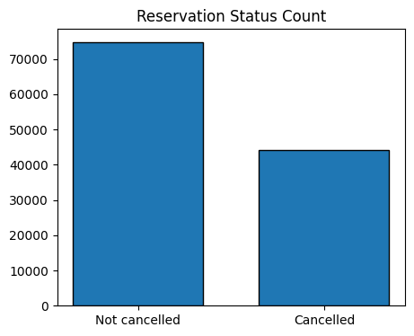
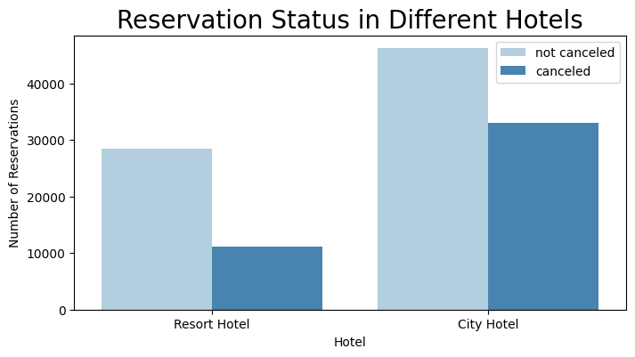
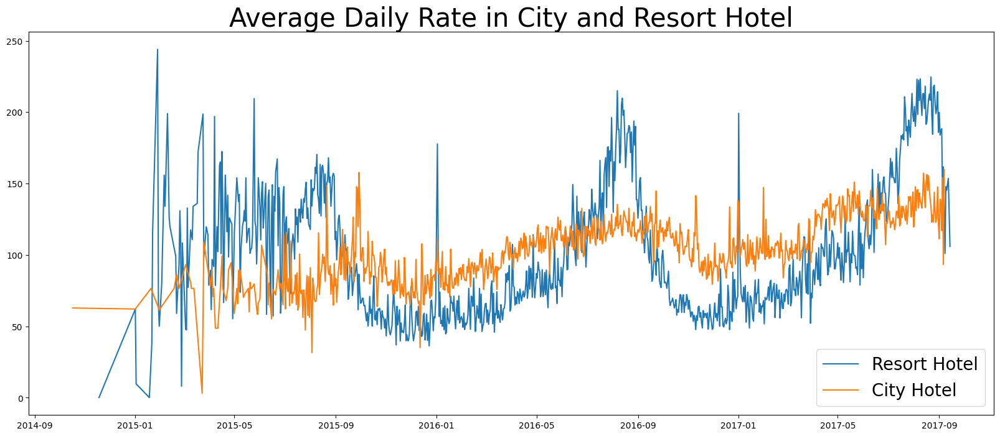
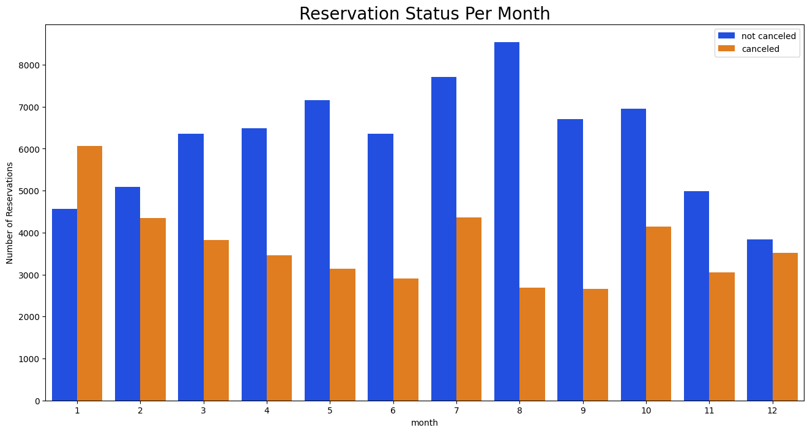
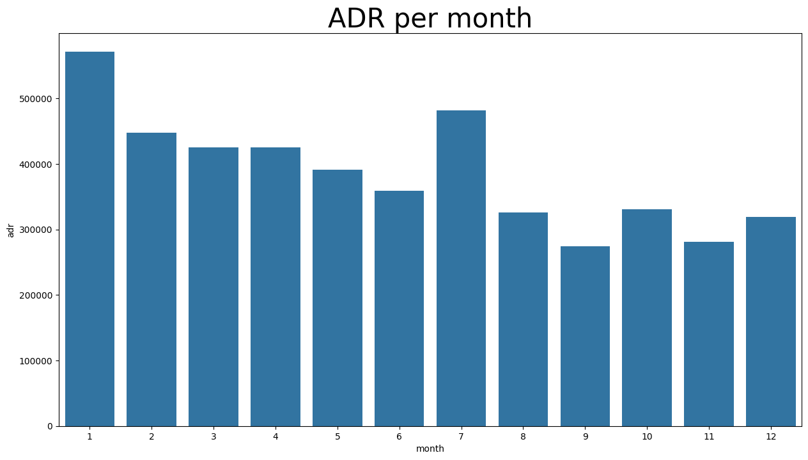
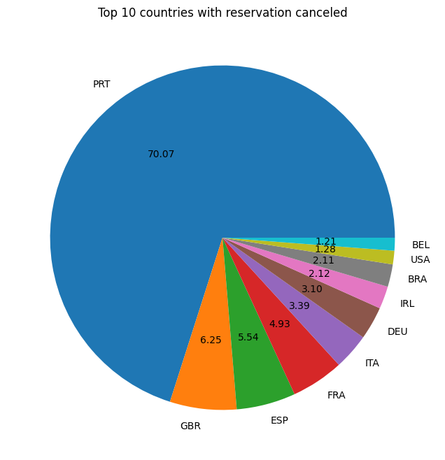
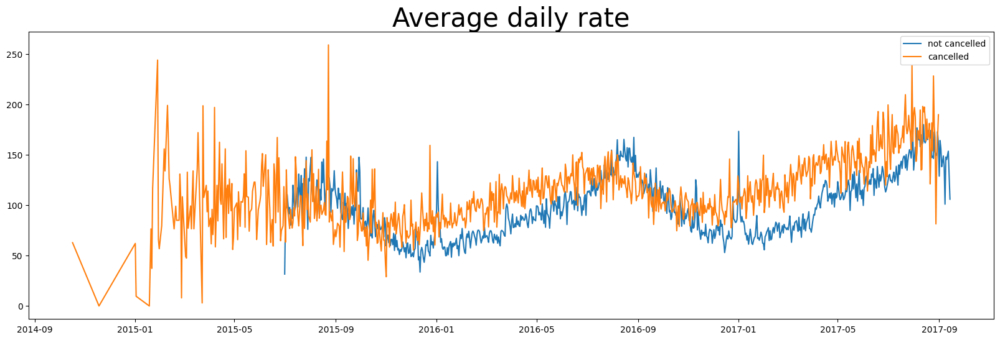
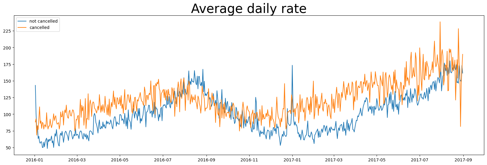

```python
import numpy as np
import pandas as pd
import matplotlib.pyplot as plt
import seaborn as sns
import warnings
warnings.filterwarnings('ignore')
```


```python
df = pd.read_csv(r"C:\Users\PC\Downloads\hotel_bookings 2.csv")
```


```python
df.head()
```


<div>
<style scoped>
    .dataframe tbody tr th:only-of-type {
        vertical-align: middle;
    }

    .dataframe tbody tr th {
        vertical-align: top;
    }

    .dataframe thead th {
        text-align: right;
    }
</style>
<table border="1" class="dataframe">
  <thead>
    <tr style="text-align: right;">
      <th></th>
      <th>hotel</th>
      <th>is_canceled</th>
      <th>lead_time</th>
      <th>arrival_date_year</th>
      <th>arrival_date_month</th>
      <th>arrival_date_week_number</th>
      <th>arrival_date_day_of_month</th>
      <th>stays_in_weekend_nights</th>
      <th>stays_in_week_nights</th>
      <th>adults</th>
      <th>...</th>
      <th>deposit_type</th>
      <th>agent</th>
      <th>company</th>
      <th>days_in_waiting_list</th>
      <th>customer_type</th>
      <th>adr</th>
      <th>required_car_parking_spaces</th>
      <th>total_of_special_requests</th>
      <th>reservation_status</th>
      <th>reservation_status_date</th>
    </tr>
  </thead>
  <tbody>
    <tr>
      <th>0</th>
      <td>Resort Hotel</td>
      <td>0</td>
      <td>342</td>
      <td>2015</td>
      <td>July</td>
      <td>27</td>
      <td>1</td>
      <td>0</td>
      <td>0</td>
      <td>2</td>
      <td>...</td>
      <td>No Deposit</td>
      <td>NaN</td>
      <td>NaN</td>
      <td>0</td>
      <td>Transient</td>
      <td>0.0</td>
      <td>0</td>
      <td>0</td>
      <td>Check-Out</td>
      <td>1/7/2015</td>
    </tr>
    <tr>
      <th>1</th>
      <td>Resort Hotel</td>
      <td>0</td>
      <td>737</td>
      <td>2015</td>
      <td>July</td>
      <td>27</td>
      <td>1</td>
      <td>0</td>
      <td>0</td>
      <td>2</td>
      <td>...</td>
      <td>No Deposit</td>
      <td>NaN</td>
      <td>NaN</td>
      <td>0</td>
      <td>Transient</td>
      <td>0.0</td>
      <td>0</td>
      <td>0</td>
      <td>Check-Out</td>
      <td>1/7/2015</td>
    </tr>
    <tr>
      <th>2</th>
      <td>Resort Hotel</td>
      <td>0</td>
      <td>7</td>
      <td>2015</td>
      <td>July</td>
      <td>27</td>
      <td>1</td>
      <td>0</td>
      <td>1</td>
      <td>1</td>
      <td>...</td>
      <td>No Deposit</td>
      <td>NaN</td>
      <td>NaN</td>
      <td>0</td>
      <td>Transient</td>
      <td>75.0</td>
      <td>0</td>
      <td>0</td>
      <td>Check-Out</td>
      <td>2/7/2015</td>
    </tr>
    <tr>
      <th>3</th>
      <td>Resort Hotel</td>
      <td>0</td>
      <td>13</td>
      <td>2015</td>
      <td>July</td>
      <td>27</td>
      <td>1</td>
      <td>0</td>
      <td>1</td>
      <td>1</td>
      <td>...</td>
      <td>No Deposit</td>
      <td>304.0</td>
      <td>NaN</td>
      <td>0</td>
      <td>Transient</td>
      <td>75.0</td>
      <td>0</td>
      <td>0</td>
      <td>Check-Out</td>
      <td>2/7/2015</td>
    </tr>
    <tr>
      <th>4</th>
      <td>Resort Hotel</td>
      <td>0</td>
      <td>14</td>
      <td>2015</td>
      <td>July</td>
      <td>27</td>
      <td>1</td>
      <td>0</td>
      <td>2</td>
      <td>2</td>
      <td>...</td>
      <td>No Deposit</td>
      <td>240.0</td>
      <td>NaN</td>
      <td>0</td>
      <td>Transient</td>
      <td>98.0</td>
      <td>0</td>
      <td>1</td>
      <td>Check-Out</td>
      <td>3/7/2015</td>
    </tr>
  </tbody>
</table>
<p>5 rows × 32 columns</p>
</div>


```python
df.tail()

```


<div>
<style scoped>
    .dataframe tbody tr th:only-of-type {
        vertical-align: middle;
    }

    .dataframe tbody tr th {
        vertical-align: top;
    }

    .dataframe thead th {
        text-align: right;
    }
</style>
<table border="1" class="dataframe">
  <thead>
    <tr style="text-align: right;">
      <th></th>
      <th>hotel</th>
      <th>is_canceled</th>
      <th>lead_time</th>
      <th>arrival_date_year</th>
      <th>arrival_date_month</th>
      <th>arrival_date_week_number</th>
      <th>arrival_date_day_of_month</th>
      <th>stays_in_weekend_nights</th>
      <th>stays_in_week_nights</th>
      <th>adults</th>
      <th>...</th>
      <th>deposit_type</th>
      <th>agent</th>
      <th>company</th>
      <th>days_in_waiting_list</th>
      <th>customer_type</th>
      <th>adr</th>
      <th>required_car_parking_spaces</th>
      <th>total_of_special_requests</th>
      <th>reservation_status</th>
      <th>reservation_status_date</th>
    </tr>
  </thead>
  <tbody>
    <tr>
      <th>119385</th>
      <td>City Hotel</td>
      <td>0</td>
      <td>23</td>
      <td>2017</td>
      <td>August</td>
      <td>35</td>
      <td>30</td>
      <td>2</td>
      <td>5</td>
      <td>2</td>
      <td>...</td>
      <td>No Deposit</td>
      <td>394.0</td>
      <td>NaN</td>
      <td>0</td>
      <td>Transient</td>
      <td>96.14</td>
      <td>0</td>
      <td>0</td>
      <td>Check-Out</td>
      <td>6/9/2017</td>
    </tr>
    <tr>
      <th>119386</th>
      <td>City Hotel</td>
      <td>0</td>
      <td>102</td>
      <td>2017</td>
      <td>August</td>
      <td>35</td>
      <td>31</td>
      <td>2</td>
      <td>5</td>
      <td>3</td>
      <td>...</td>
      <td>No Deposit</td>
      <td>9.0</td>
      <td>NaN</td>
      <td>0</td>
      <td>Transient</td>
      <td>225.43</td>
      <td>0</td>
      <td>2</td>
      <td>Check-Out</td>
      <td>7/9/2017</td>
    </tr>
    <tr>
      <th>119387</th>
      <td>City Hotel</td>
      <td>0</td>
      <td>34</td>
      <td>2017</td>
      <td>August</td>
      <td>35</td>
      <td>31</td>
      <td>2</td>
      <td>5</td>
      <td>2</td>
      <td>...</td>
      <td>No Deposit</td>
      <td>9.0</td>
      <td>NaN</td>
      <td>0</td>
      <td>Transient</td>
      <td>157.71</td>
      <td>0</td>
      <td>4</td>
      <td>Check-Out</td>
      <td>7/9/2017</td>
    </tr>
    <tr>
      <th>119388</th>
      <td>City Hotel</td>
      <td>0</td>
      <td>109</td>
      <td>2017</td>
      <td>August</td>
      <td>35</td>
      <td>31</td>
      <td>2</td>
      <td>5</td>
      <td>2</td>
      <td>...</td>
      <td>No Deposit</td>
      <td>89.0</td>
      <td>NaN</td>
      <td>0</td>
      <td>Transient</td>
      <td>104.40</td>
      <td>0</td>
      <td>0</td>
      <td>Check-Out</td>
      <td>7/9/2017</td>
    </tr>
    <tr>
      <th>119389</th>
      <td>City Hotel</td>
      <td>0</td>
      <td>205</td>
      <td>2017</td>
      <td>August</td>
      <td>35</td>
      <td>29</td>
      <td>2</td>
      <td>7</td>
      <td>2</td>
      <td>...</td>
      <td>No Deposit</td>
      <td>9.0</td>
      <td>NaN</td>
      <td>0</td>
      <td>Transient</td>
      <td>151.20</td>
      <td>0</td>
      <td>2</td>
      <td>Check-Out</td>
      <td>7/9/2017</td>
    </tr>
  </tbody>
</table>
<p>5 rows × 32 columns</p>
</div>


```python
df.shape
```


    (119390, 32)


```python
df.columns
```


    Index(['hotel', 'is_canceled', 'lead_time', 'arrival_date_year',
           'arrival_date_month', 'arrival_date_week_number',
           'arrival_date_day_of_month', 'stays_in_weekend_nights',
           'stays_in_week_nights', 'adults', 'children', 'babies', 'meal',
           'country', 'market_segment', 'distribution_channel',
           'is_repeated_guest', 'previous_cancellations',
           'previous_bookings_not_canceled', 'reserved_room_type',
           'assigned_room_type', 'booking_changes', 'deposit_type', 'agent',
           'company', 'days_in_waiting_list', 'customer_type', 'adr',
           'required_car_parking_spaces', 'total_of_special_requests',
           'reservation_status', 'reservation_status_date'],
          dtype='object')


```python
df.info()
```

    <class 'pandas.core.frame.DataFrame'>
    RangeIndex: 119390 entries, 0 to 119389
    Data columns (total 32 columns):
     #   Column                          Non-Null Count   Dtype  
    ---  ------                          --------------   -----  
     0   hotel                           119390 non-null  object 
     1   is_canceled                     119390 non-null  int64  
     2   lead_time                       119390 non-null  int64  
     3   arrival_date_year               119390 non-null  int64  
     4   arrival_date_month              119390 non-null  object 
     5   arrival_date_week_number        119390 non-null  int64  
     6   arrival_date_day_of_month       119390 non-null  int64  
     7   stays_in_weekend_nights         119390 non-null  int64  
     8   stays_in_week_nights            119390 non-null  int64  
     9   adults                          119390 non-null  int64  
     10  children                        119386 non-null  float64
     11  babies                          119390 non-null  int64  
     12  meal                            119390 non-null  object 
     13  country                         118902 non-null  object 
     14  market_segment                  119390 non-null  object 
     15  distribution_channel            119390 non-null  object 
     16  is_repeated_guest               119390 non-null  int64  
     17  previous_cancellations          119390 non-null  int64  
     18  previous_bookings_not_canceled  119390 non-null  int64  
     19  reserved_room_type              119390 non-null  object 
     20  assigned_room_type              119390 non-null  object 
     21  booking_changes                 119390 non-null  int64  
     22  deposit_type                    119390 non-null  object 
     23  agent                           103050 non-null  float64
     24  company                         6797 non-null    float64
     25  days_in_waiting_list            119390 non-null  int64  
     26  customer_type                   119390 non-null  object 
     27  adr                             119390 non-null  float64
     28  required_car_parking_spaces     119390 non-null  int64  
     29  total_of_special_requests       119390 non-null  int64  
     30  reservation_status              119390 non-null  object 
     31  reservation_status_date         119390 non-null  object 
    dtypes: float64(4), int64(16), object(12)
    memory usage: 29.1+ MB
    


```python
df['reservation_status_date'] = pd.to_datetime(df['reservation_status_date'], format = '%d/%m/%Y')
```


```python
df.info()
```

    <class 'pandas.core.frame.DataFrame'>
    RangeIndex: 119390 entries, 0 to 119389
    Data columns (total 32 columns):
     #   Column                          Non-Null Count   Dtype         
    ---  ------                          --------------   -----         
     0   hotel                           119390 non-null  object        
     1   is_canceled                     119390 non-null  int64         
     2   lead_time                       119390 non-null  int64         
     3   arrival_date_year               119390 non-null  int64         
     4   arrival_date_month              119390 non-null  object        
     5   arrival_date_week_number        119390 non-null  int64         
     6   arrival_date_day_of_month       119390 non-null  int64         
     7   stays_in_weekend_nights         119390 non-null  int64         
     8   stays_in_week_nights            119390 non-null  int64         
     9   adults                          119390 non-null  int64         
     10  children                        119386 non-null  float64       
     11  babies                          119390 non-null  int64         
     12  meal                            119390 non-null  object        
     13  country                         118902 non-null  object        
     14  market_segment                  119390 non-null  object        
     15  distribution_channel            119390 non-null  object        
     16  is_repeated_guest               119390 non-null  int64         
     17  previous_cancellations          119390 non-null  int64         
     18  previous_bookings_not_canceled  119390 non-null  int64         
     19  reserved_room_type              119390 non-null  object        
     20  assigned_room_type              119390 non-null  object        
     21  booking_changes                 119390 non-null  int64         
     22  deposit_type                    119390 non-null  object        
     23  agent                           103050 non-null  float64       
     24  company                         6797 non-null    float64       
     25  days_in_waiting_list            119390 non-null  int64         
     26  customer_type                   119390 non-null  object        
     27  adr                             119390 non-null  float64       
     28  required_car_parking_spaces     119390 non-null  int64         
     29  total_of_special_requests       119390 non-null  int64         
     30  reservation_status              119390 non-null  object        
     31  reservation_status_date         119390 non-null  datetime64[ns]
    dtypes: datetime64[ns](1), float64(4), int64(16), object(11)
    memory usage: 29.1+ MB
    


```python
df.describe(include = 'object')
```


<div>
<style scoped>
    .dataframe tbody tr th:only-of-type {
        vertical-align: middle;
    }

    .dataframe tbody tr th {
        vertical-align: top;
    }

    .dataframe thead th {
        text-align: right;
    }
</style>
<table border="1" class="dataframe">
  <thead>
    <tr style="text-align: right;">
      <th></th>
      <th>hotel</th>
      <th>arrival_date_month</th>
      <th>meal</th>
      <th>country</th>
      <th>market_segment</th>
      <th>distribution_channel</th>
      <th>reserved_room_type</th>
      <th>assigned_room_type</th>
      <th>deposit_type</th>
      <th>customer_type</th>
      <th>reservation_status</th>
    </tr>
  </thead>
  <tbody>
    <tr>
      <th>count</th>
      <td>119390</td>
      <td>119390</td>
      <td>119390</td>
      <td>118902</td>
      <td>119390</td>
      <td>119390</td>
      <td>119390</td>
      <td>119390</td>
      <td>119390</td>
      <td>119390</td>
      <td>119390</td>
    </tr>
    <tr>
      <th>unique</th>
      <td>2</td>
      <td>12</td>
      <td>5</td>
      <td>177</td>
      <td>8</td>
      <td>5</td>
      <td>10</td>
      <td>12</td>
      <td>3</td>
      <td>4</td>
      <td>3</td>
    </tr>
    <tr>
      <th>top</th>
      <td>City Hotel</td>
      <td>August</td>
      <td>BB</td>
      <td>PRT</td>
      <td>Online TA</td>
      <td>TA/TO</td>
      <td>A</td>
      <td>A</td>
      <td>No Deposit</td>
      <td>Transient</td>
      <td>Check-Out</td>
    </tr>
    <tr>
      <th>freq</th>
      <td>79330</td>
      <td>13877</td>
      <td>92310</td>
      <td>48590</td>
      <td>56477</td>
      <td>97870</td>
      <td>85994</td>
      <td>74053</td>
      <td>104641</td>
      <td>89613</td>
      <td>75166</td>
    </tr>
  </tbody>
</table>
</div>


```python
for col in df.describe(include = 'object').columns:
    print(col)
    print(df[col].unique())
    print('-'*50)
```

    hotel
    ['Resort Hotel' 'City Hotel']
    --------------------------------------------------
    arrival_date_month
    ['July' 'August' 'September' 'October' 'November' 'December' 'January'
     'February' 'March' 'April' 'May' 'June']
    --------------------------------------------------
    meal
    ['BB' 'FB' 'HB' 'SC' 'Undefined']
    --------------------------------------------------
    country
    ['PRT' 'GBR' 'USA' 'ESP' 'IRL' 'FRA' nan 'ROU' 'NOR' 'OMN' 'ARG' 'POL'
     'DEU' 'BEL' 'CHE' 'CN' 'GRC' 'ITA' 'NLD' 'DNK' 'RUS' 'SWE' 'AUS' 'EST'
     'CZE' 'BRA' 'FIN' 'MOZ' 'BWA' 'LUX' 'SVN' 'ALB' 'IND' 'CHN' 'MEX' 'MAR'
     'UKR' 'SMR' 'LVA' 'PRI' 'SRB' 'CHL' 'AUT' 'BLR' 'LTU' 'TUR' 'ZAF' 'AGO'
     'ISR' 'CYM' 'ZMB' 'CPV' 'ZWE' 'DZA' 'KOR' 'CRI' 'HUN' 'ARE' 'TUN' 'JAM'
     'HRV' 'HKG' 'IRN' 'GEO' 'AND' 'GIB' 'URY' 'JEY' 'CAF' 'CYP' 'COL' 'GGY'
     'KWT' 'NGA' 'MDV' 'VEN' 'SVK' 'FJI' 'KAZ' 'PAK' 'IDN' 'LBN' 'PHL' 'SEN'
     'SYC' 'AZE' 'BHR' 'NZL' 'THA' 'DOM' 'MKD' 'MYS' 'ARM' 'JPN' 'LKA' 'CUB'
     'CMR' 'BIH' 'MUS' 'COM' 'SUR' 'UGA' 'BGR' 'CIV' 'JOR' 'SYR' 'SGP' 'BDI'
     'SAU' 'VNM' 'PLW' 'QAT' 'EGY' 'PER' 'MLT' 'MWI' 'ECU' 'MDG' 'ISL' 'UZB'
     'NPL' 'BHS' 'MAC' 'TGO' 'TWN' 'DJI' 'STP' 'KNA' 'ETH' 'IRQ' 'HND' 'RWA'
     'KHM' 'MCO' 'BGD' 'IMN' 'TJK' 'NIC' 'BEN' 'VGB' 'TZA' 'GAB' 'GHA' 'TMP'
     'GLP' 'KEN' 'LIE' 'GNB' 'MNE' 'UMI' 'MYT' 'FRO' 'MMR' 'PAN' 'BFA' 'LBY'
     'MLI' 'NAM' 'BOL' 'PRY' 'BRB' 'ABW' 'AIA' 'SLV' 'DMA' 'PYF' 'GUY' 'LCA'
     'ATA' 'GTM' 'ASM' 'MRT' 'NCL' 'KIR' 'SDN' 'ATF' 'SLE' 'LAO']
    --------------------------------------------------
    market_segment
    ['Direct' 'Corporate' 'Online TA' 'Offline TA/TO' 'Complementary' 'Groups'
     'Undefined' 'Aviation']
    --------------------------------------------------
    distribution_channel
    ['Direct' 'Corporate' 'TA/TO' 'Undefined' 'GDS']
    --------------------------------------------------
    reserved_room_type
    ['C' 'A' 'D' 'E' 'G' 'F' 'H' 'L' 'P' 'B']
    --------------------------------------------------
    assigned_room_type
    ['C' 'A' 'D' 'E' 'G' 'F' 'I' 'B' 'H' 'P' 'L' 'K']
    --------------------------------------------------
    deposit_type
    ['No Deposit' 'Refundable' 'Non Refund']
    --------------------------------------------------
    customer_type
    ['Transient' 'Contract' 'Transient-Party' 'Group']
    --------------------------------------------------
    reservation_status
    ['Check-Out' 'Canceled' 'No-Show']
    --------------------------------------------------
    


```python
df.isnull().sum()
```


    hotel                                  0
    is_canceled                            0
    lead_time                              0
    arrival_date_year                      0
    arrival_date_month                     0
    arrival_date_week_number               0
    arrival_date_day_of_month              0
    stays_in_weekend_nights                0
    stays_in_week_nights                   0
    adults                                 0
    children                               4
    babies                                 0
    meal                                   0
    country                              488
    market_segment                         0
    distribution_channel                   0
    is_repeated_guest                      0
    previous_cancellations                 0
    previous_bookings_not_canceled         0
    reserved_room_type                     0
    assigned_room_type                     0
    booking_changes                        0
    deposit_type                           0
    agent                              16340
    company                           112593
    days_in_waiting_list                   0
    customer_type                          0
    adr                                    0
    required_car_parking_spaces            0
    total_of_special_requests              0
    reservation_status                     0
    reservation_status_date                0
    dtype: int64


```python
df.drop(['company', 'agent'], axis = 1, inplace = True)   #axis=1 means removing columns and inplace means doing changes in dataframe
```


```python
df.dropna(inplace = True)
```


```python
df.isnull().sum()
```


    hotel                             0
    is_canceled                       0
    lead_time                         0
    arrival_date_year                 0
    arrival_date_month                0
    arrival_date_week_number          0
    arrival_date_day_of_month         0
    stays_in_weekend_nights           0
    stays_in_week_nights              0
    adults                            0
    children                          0
    babies                            0
    meal                              0
    country                           0
    market_segment                    0
    distribution_channel              0
    is_repeated_guest                 0
    previous_cancellations            0
    previous_bookings_not_canceled    0
    reserved_room_type                0
    assigned_room_type                0
    booking_changes                   0
    deposit_type                      0
    days_in_waiting_list              0
    customer_type                     0
    adr                               0
    required_car_parking_spaces       0
    total_of_special_requests         0
    reservation_status                0
    reservation_status_date           0
    dtype: int64


```python
df.describe()
```


<div>
<style scoped>
    .dataframe tbody tr th:only-of-type {
        vertical-align: middle;
    }

    .dataframe tbody tr th {
        vertical-align: top;
    }

    .dataframe thead th {
        text-align: right;
    }
</style>
<table border="1" class="dataframe">
  <thead>
    <tr style="text-align: right;">
      <th></th>
      <th>is_canceled</th>
      <th>lead_time</th>
      <th>arrival_date_year</th>
      <th>arrival_date_week_number</th>
      <th>arrival_date_day_of_month</th>
      <th>stays_in_weekend_nights</th>
      <th>stays_in_week_nights</th>
      <th>adults</th>
      <th>children</th>
      <th>babies</th>
      <th>is_repeated_guest</th>
      <th>previous_cancellations</th>
      <th>previous_bookings_not_canceled</th>
      <th>booking_changes</th>
      <th>days_in_waiting_list</th>
      <th>adr</th>
      <th>required_car_parking_spaces</th>
      <th>total_of_special_requests</th>
      <th>reservation_status_date</th>
    </tr>
  </thead>
  <tbody>
    <tr>
      <th>count</th>
      <td>118898.000000</td>
      <td>118898.000000</td>
      <td>118898.000000</td>
      <td>118898.000000</td>
      <td>118898.000000</td>
      <td>118898.000000</td>
      <td>118898.000000</td>
      <td>118898.000000</td>
      <td>118898.000000</td>
      <td>118898.000000</td>
      <td>118898.000000</td>
      <td>118898.000000</td>
      <td>118898.000000</td>
      <td>118898.000000</td>
      <td>118898.000000</td>
      <td>118898.000000</td>
      <td>118898.000000</td>
      <td>118898.000000</td>
      <td>118898</td>
    </tr>
    <tr>
      <th>mean</th>
      <td>0.371352</td>
      <td>104.311435</td>
      <td>2016.157656</td>
      <td>27.166555</td>
      <td>15.800880</td>
      <td>0.928897</td>
      <td>2.502145</td>
      <td>1.858391</td>
      <td>0.104207</td>
      <td>0.007948</td>
      <td>0.032011</td>
      <td>0.087142</td>
      <td>0.131634</td>
      <td>0.221181</td>
      <td>2.330754</td>
      <td>102.003243</td>
      <td>0.061885</td>
      <td>0.571683</td>
      <td>2016-07-30 07:37:53.336809984</td>
    </tr>
    <tr>
      <th>min</th>
      <td>0.000000</td>
      <td>0.000000</td>
      <td>2015.000000</td>
      <td>1.000000</td>
      <td>1.000000</td>
      <td>0.000000</td>
      <td>0.000000</td>
      <td>0.000000</td>
      <td>0.000000</td>
      <td>0.000000</td>
      <td>0.000000</td>
      <td>0.000000</td>
      <td>0.000000</td>
      <td>0.000000</td>
      <td>0.000000</td>
      <td>-6.380000</td>
      <td>0.000000</td>
      <td>0.000000</td>
      <td>2014-10-17 00:00:00</td>
    </tr>
    <tr>
      <th>25%</th>
      <td>0.000000</td>
      <td>18.000000</td>
      <td>2016.000000</td>
      <td>16.000000</td>
      <td>8.000000</td>
      <td>0.000000</td>
      <td>1.000000</td>
      <td>2.000000</td>
      <td>0.000000</td>
      <td>0.000000</td>
      <td>0.000000</td>
      <td>0.000000</td>
      <td>0.000000</td>
      <td>0.000000</td>
      <td>0.000000</td>
      <td>70.000000</td>
      <td>0.000000</td>
      <td>0.000000</td>
      <td>2016-02-02 00:00:00</td>
    </tr>
    <tr>
      <th>50%</th>
      <td>0.000000</td>
      <td>69.000000</td>
      <td>2016.000000</td>
      <td>28.000000</td>
      <td>16.000000</td>
      <td>1.000000</td>
      <td>2.000000</td>
      <td>2.000000</td>
      <td>0.000000</td>
      <td>0.000000</td>
      <td>0.000000</td>
      <td>0.000000</td>
      <td>0.000000</td>
      <td>0.000000</td>
      <td>0.000000</td>
      <td>95.000000</td>
      <td>0.000000</td>
      <td>0.000000</td>
      <td>2016-08-08 00:00:00</td>
    </tr>
    <tr>
      <th>75%</th>
      <td>1.000000</td>
      <td>161.000000</td>
      <td>2017.000000</td>
      <td>38.000000</td>
      <td>23.000000</td>
      <td>2.000000</td>
      <td>3.000000</td>
      <td>2.000000</td>
      <td>0.000000</td>
      <td>0.000000</td>
      <td>0.000000</td>
      <td>0.000000</td>
      <td>0.000000</td>
      <td>0.000000</td>
      <td>0.000000</td>
      <td>126.000000</td>
      <td>0.000000</td>
      <td>1.000000</td>
      <td>2017-02-09 00:00:00</td>
    </tr>
    <tr>
      <th>max</th>
      <td>1.000000</td>
      <td>737.000000</td>
      <td>2017.000000</td>
      <td>53.000000</td>
      <td>31.000000</td>
      <td>16.000000</td>
      <td>41.000000</td>
      <td>55.000000</td>
      <td>10.000000</td>
      <td>10.000000</td>
      <td>1.000000</td>
      <td>26.000000</td>
      <td>72.000000</td>
      <td>21.000000</td>
      <td>391.000000</td>
      <td>5400.000000</td>
      <td>8.000000</td>
      <td>5.000000</td>
      <td>2017-09-14 00:00:00</td>
    </tr>
    <tr>
      <th>std</th>
      <td>0.483168</td>
      <td>106.903309</td>
      <td>0.707459</td>
      <td>13.589971</td>
      <td>8.780324</td>
      <td>0.996216</td>
      <td>1.900168</td>
      <td>0.578576</td>
      <td>0.399172</td>
      <td>0.097380</td>
      <td>0.176029</td>
      <td>0.845869</td>
      <td>1.484672</td>
      <td>0.652785</td>
      <td>17.630452</td>
      <td>50.485862</td>
      <td>0.244172</td>
      <td>0.792678</td>
      <td>NaN</td>
    </tr>
  </tbody>
</table>
</div>


```python
df = df[df['adr']<5000]      #adr has many outliers having value more than 5000, making dataset comples, therefore, removing uneccessary data
```


```python
cancelled_perc = df['is_canceled'].value_counts(normalize = True)
cancelled_perc    # 1 shows reservation cancelled
```


    is_canceled
    0    0.628653
    1    0.371347
    Name: proportion, dtype: float64


```python
print(cancelled_perc)
plt.figure(figsize = (5,4))
plt.title('Reservation Status Count')
plt.bar(['Not cancelled', 'Cancelled'], df['is_canceled'].value_counts(), edgecolor = 'k', width = 0.7)
plt.show()
```

    is_canceled
    0    0.628653
    1    0.371347
    Name: proportion, dtype: float64
    


    

    


```python
plt.figure(figsize = (8,4))
ax1 = sns.countplot(x = 'hotel', hue = 'is_canceled', data = df, palette = 'Blues')
legend_labels = ax1.get_legend_handles_labels()
ax1.legend(bbox_to_anchor=(1,1))
plt.title('Reservation Status in Different Hotels', size = 20)
plt.xlabel('Hotel')
plt.ylabel('Number of Reservations')
plt.legend(['not canceled', 'canceled'])
plt.show()
```


    

    


```python
resort_hotel = df[df['hotel']=='Resort Hotel']
resort_hotel['is_canceled'].value_counts(normalize=True)
```


    is_canceled
    0    0.72025
    1    0.27975
    Name: proportion, dtype: float64


```python
city_hotel = df[df['hotel']=='City Hotel']
city_hotel['is_canceled'].value_counts(normalize=True)
```


    is_canceled
    0    0.582918
    1    0.417082
    Name: proportion, dtype: float64


```python
resort_hotel = resort_hotel.groupby('reservation_status_date')[['adr']].mean()
city_hotel = city_hotel.groupby('reservation_status_date')[['adr']].mean()
```


```python
plt.figure(figsize = (20,8))
plt.title('Average Daily Rate in City and Resort Hotel', fontsize = 30)
plt.plot(resort_hotel.index, resort_hotel['adr'], label = 'Resort Hotel')
plt.plot(city_hotel.index, city_hotel['adr'], label = 'City Hotel')
plt.legend(fontsize = 20)
plt.show()

```


    

    


```python
df['month'] = df['reservation_status_date'].dt.month
plt.figure(figsize = (16,8))
ax1 = sns.countplot(x = 'month', hue = 'is_canceled', data = df, palette = 'bright')
legend_labels = ax1.get_legend_handles_labels()
ax1.legend(bbox_to_anchor=(1,1))
plt.title('Reservation Status Per Month', size = 20)
plt.xlabel('month')
plt.ylabel('Number of Reservations')
plt.legend(['not canceled','canceled'])
plt.show()
```


    

    


```python
plt.figure(figsize = (15,8))
plt.title('ADR per month', fontsize = 30)
sns.barplot(x='month', y='adr', data = df[df['is_canceled'] == 1].groupby('month')[['adr']].sum().reset_index())

plt.show()
```


    

    


```python
cancelled_data = df[df['is_canceled']==1]
top_10_country = cancelled_data['country'].value_counts()[:10]
plt.figure(figsize = (8,8))
plt.title('Top 10 countries with reservation canceled')
plt.pie(top_10_country, autopct = '%.2f', labels = top_10_country.index)
plt.show()
```


    

    


```python
df['market_segment'].value_counts()
```


    market_segment
    Online TA        56402
    Offline TA/TO    24159
    Groups           19806
    Direct           12448
    Corporate         5111
    Complementary      734
    Aviation           237
    Name: count, dtype: int64


```python
df['market_segment'].value_counts(normalize = True)   # TA = travel agents
```


    market_segment
    Online TA        0.474377
    Offline TA/TO    0.203193
    Groups           0.166581
    Direct           0.104696
    Corporate        0.042987
    Complementary    0.006173
    Aviation         0.001993
    Name: proportion, dtype: float64


```python
cancelled_data['market_segment'].value_counts(normalize = True)
```


    market_segment
    Online TA        0.469696
    Groups           0.273985
    Offline TA/TO    0.187466
    Direct           0.043486
    Corporate        0.022151
    Complementary    0.002038
    Aviation         0.001178
    Name: proportion, dtype: float64


```python
cancelled_df_adr = cancelled_data.groupby('reservation_status_date')[['adr']].mean()
cancelled_df_adr.reset_index(inplace = True)
cancelled_df_adr.sort_values('reservation_status_date', inplace = True)

not_cancelled_data = df[df['is_canceled']==0]
not_cancelled_df_adr = not_cancelled_data.groupby('reservation_status_date')[['adr']].mean()
not_cancelled_df_adr.reset_index(inplace = True)
not_cancelled_df_adr.sort_values('reservation_status_date', inplace = True)

plt.figure(figsize = (20,6))
plt.title('Average daily rate', fontsize =30)
plt.plot(not_cancelled_df_adr['reservation_status_date'], not_cancelled_df_adr['adr'], label = 'not cancelled')
plt.plot(cancelled_df_adr['reservation_status_date'], cancelled_df_adr['adr'], label = 'cancelled')
plt.legend()

```


    <matplotlib.legend.Legend at 0x1fb0832a650>


    

    


```python
cancelled_df_adr = cancelled_df_adr[(cancelled_df_adr['reservation_status_date']>'2016') & (cancelled_df_adr['reservation_status_date']<'2017-09')]
not_cancelled_df_adr = not_cancelled_df_adr[(not_cancelled_df_adr['reservation_status_date']>'2016') & (not_cancelled_df_adr['reservation_status_date']<'2017-09')]
```


```python
plt.figure(figsize = (20,6))
plt.title('Average daily rate', fontsize =30)
plt.plot(not_cancelled_df_adr['reservation_status_date'], not_cancelled_df_adr['adr'], label = 'not cancelled')
plt.plot(cancelled_df_adr['reservation_status_date'], cancelled_df_adr['adr'], label = 'cancelled')
plt.legend()
```


    <matplotlib.legend.Legend at 0x1fb038bfd90>


    

    


```python

```
